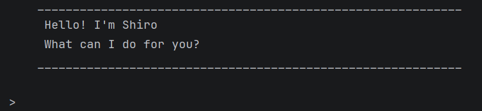

# Shiro User Guide



Shiro is a desktop task management chatbot for users who prefer typing commands over clicking buttons. It helps you manage todos, deadlines, and events quickly through a Command Line Interface (CLI).

## Adding todos

Adds a todo task to the task list. This type of task does not have a specific date or time associated with it.

Format: `todo DESCRIPTION`

Example: `todo borrow book`

Creates a new todo task with the given description and confirms that the task has been added.

```
    ____________________________________________________________
     Got it. I've added this task:
     [T][ ] borrow book
     Now you have 1 task in the list.
    ____________________________________________________________
```

## Adding events

Adds an event task with a start time and end time.

Format: `event DESCRIPTION /from START /to END`

Example: `event project meeting /from 10am /to 12pm`

Creates a new event task with the given description, start time, and end time, and confirms that the task has been added.

```
    ____________________________________________________________
     Got it. I've added this task:
     [E][ ] project meeting (from: 10am to: 12pm)
     Now you have 2 tasks in the list.
    ____________________________________________________________
```


## Adding deadlines

Adds a deadline task with a specified due time.

Format: `deadline DESCRIPTION /by TIME`

Example: `deadline submit report /by 5pm`

Creates a new deadline task with the given description and due time, and confirms that the task has been added.

```
    ____________________________________________________________
     Got it. I've added this task:
     [D][ ] submit report (by: 5pm)
     Now you have 3 tasks in the list.
    ____________________________________________________________
```


## Viewing all tasks

Displays a list of all tasks in the task list, including their type, status, description, and any associated dates or times.

Format: `list`

Example: `list`

Shows all tasks in the task list with their index, type, and completion status.

```
    ____________________________________________________________
     Here are the tasks in your list:
     1.[T][ ] borrow book
     2.[E][ ] project meeting (from: 10am to: 12pm)
     3.[D][ ] submit report (by: 5pm)
    ____________________________________________________________
```


## Marking tasks

Marks a task as completed based on its index in the task list.

Format: `mark INDEX`

Example: `mark 1`

Marks the first task in the list as done and confirms the action.

```
    ____________________________________________________________
     Nice! I've marked this task as done:
     [T][X] borrow book
    ____________________________________________________________
```

## Unmarking tasks

Unmarks a task as not completed based on its index in the task list.

Format: `unmark INDEX`

Example: `unmark 1`

Unmarks the first task in the list as not done and confirms the action.

```
    ____________________________________________________________
     OK, I've marked this task as not done yet:
     [T][ ] borrow book
    ____________________________________________________________
```

## Deleting tasks

Deletes a task from the task list based on its index.

Format: `delete INDEX`

Example: `delete 2`

Removes the specified task and updates the total number of tasks in the list.

```
    ____________________________________________________________
     Noted. I've removed this task:
     [E][ ] project meeting (from: 10am to: 12pm)
     Now you have 2 tasks in the list.
    ____________________________________________________________
```


## Finding tasks

Finds tasks whose descriptions contain the given keyword.

Format: `find KEYWORD`

Example: `find book`

Displays tasks whose descriptions contain the keyword "book".

```
    ____________________________________________________________
     Here are the matching tasks in your list:
     1.[T][ ] borrow book
     2.[T][ ] read book
    ____________________________________________________________
```


## Exiting the application

Closes the Shiro chatbot application.

Format: `bye`

Example: `bye`

Says goodbye to the user and exits the application.

```
    ____________________________________________________________
     Bye. Hope to see you again soon!
    ____________________________________________________________
```


## Command Summary

| Command | Description |
|-------|-------------|
| `todo DESCRIPTION` | Adds a todo task |
| `deadline DESCRIPTION /by TIME` | Adds a deadline task |
| `event DESCRIPTION /from START /to END` | Adds an event task |
| `list` | Displays all tasks |
| `mark INDEX` | Marks a task as completed |
| `unmark INDEX` | Marks a task as not completed |
| `delete INDEX` | Deletes a task |
| `find KEYWORD` | Finds tasks containing the keyword |
| `bye` | Exits the application |

